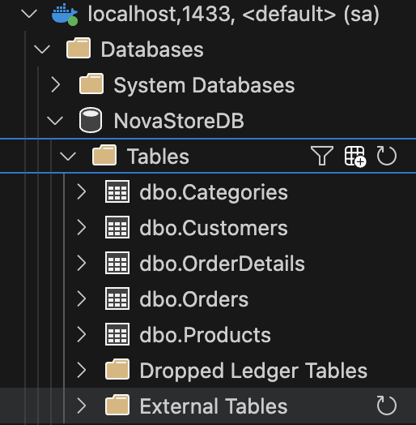
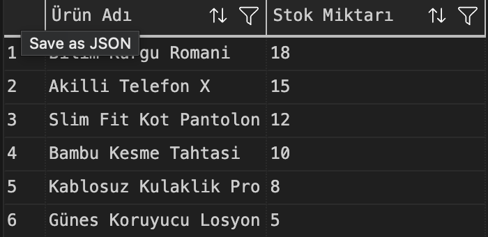
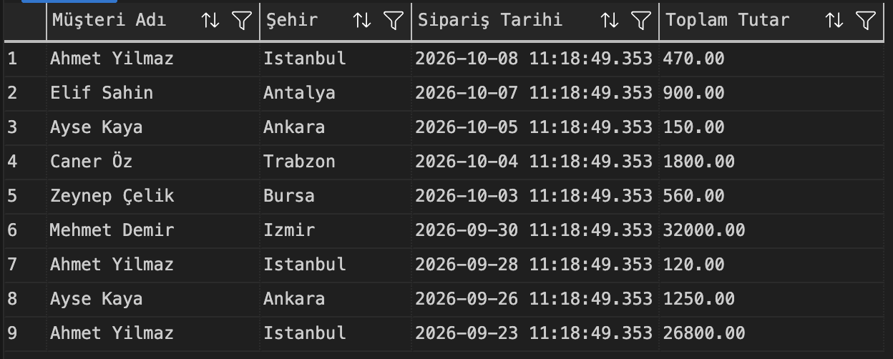
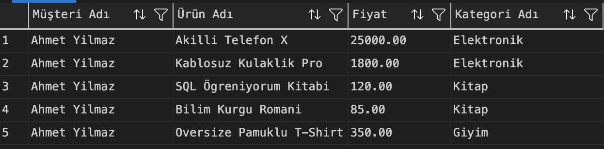
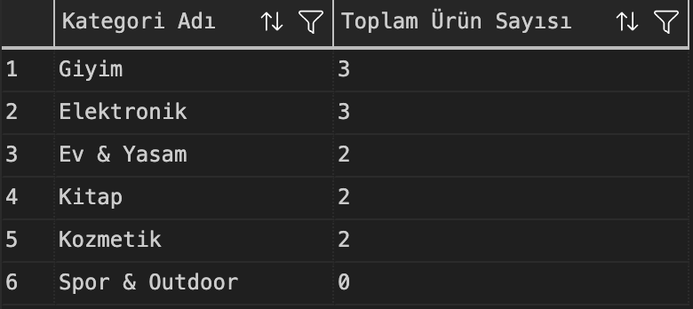
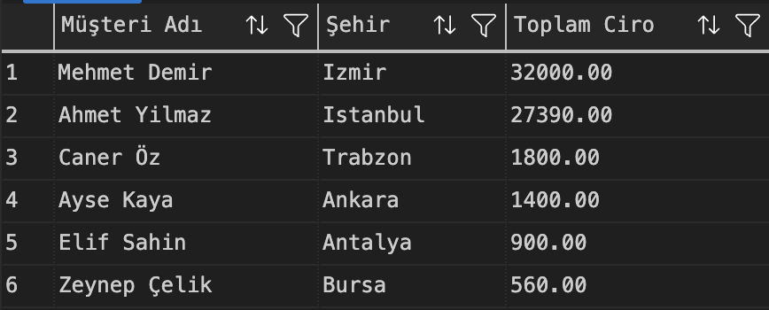
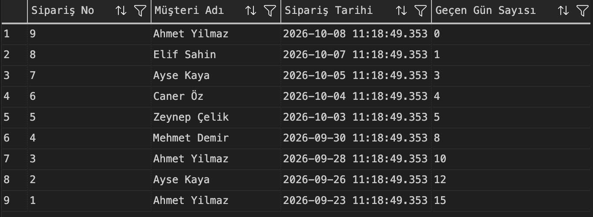
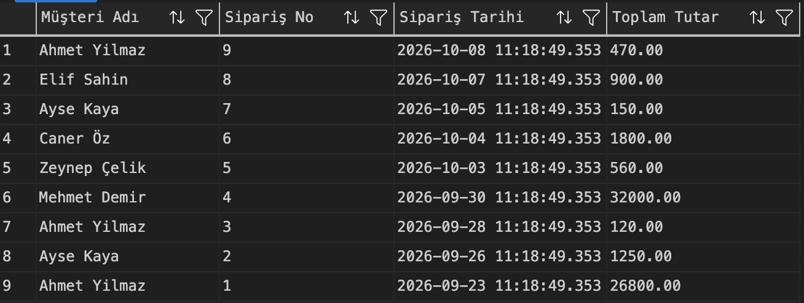

# 🛒 NovaStore - E-Ticaret Veri Tabanı Yönetim Sistemi

Bu çalışma; ilişkisel veri tabanı tasarımı (DDL), veri manipülasyonu (DML), iş zekası & veri analitiği sorgulamaları (DQL) ve ileri düzey veri tabanı nesnelerini (View & Backup) kapsayan uçtan uca bir Microsoft SQL Server (MSSQL) projesidir.

---

## 📁 Proje Dosya Yapısı ve Ekran Görüntüleri

### 1. Bölüm: Veritabanı ve Tablo Mimarisi (DDL)
* **Dosya:** `NovaStore_Schema.sql`
* `NovaStoreDB` veritabanı ile ilişkisel 5 temel tablo oluşturulmuştur: `Categories`, `Products`, `Customers`, `Orders`, `OrderDetails`.

---

### 2. Bölüm: Örnek Veri Girişi (DML)
* **Dosya:** `NovaStore_Data.sql`
* Test ve analiz senaryolarına uygun ilişkisel veri seti eklenmiştir (6 Kategori, 12 Ürün, 6 Müşteri, 9 Sipariş ve Sipariş Detayları).

---

### 3. Bölüm: İş Zekası ve Analiz Sorguları (DQL)
* **Dosya:** `NovaStore_Queries.sql`

* **Soru 1: Kritik Stok Analizi (WHERE & ORDER BY)**

* **Soru 2: Müşteri Sipariş Bilgileri Raporu (INNER JOIN)**

* **Soru 3: Müşteri Sepet Detay Raporu (5 Tablolu Zincirleme JOIN)**

* **Soru 4: Kategori Bazlı Ürün Dağılımı (LEFT JOIN & COUNT)**

* **Soru 5: Müşteri Ciro Analizi (GROUP BY & SUM)**

* **Soru 6: Zaman Analizi (DATEDIFF & GETDATE)**

---

### 4. Bölüm: İleri Düzey Nesneler ve Güvenlik
* **Dosya:** `NovaStore_Advanced.sql`

* **Sanal Tablo (View) Testi:** `vw_CustomerOrderSummary`

* **Tam Veritabanı Yedeği (Backup):**

---

## 🛠️ Kullanılan Teknolojiler
* **RDBMS:** Microsoft SQL Server 2022
* **Geliştirme Ortamı:** Visual Studio Code (MSSQL Eklentisi)
* **Konteyner Mimarisi:** Docker Desktop (macOS Apple Silicon)
* **Sürüm Kontrolü:** Git & GitHub

---

## 👤 Geliştirici
* **Adı Soyadı:** [Sevda Elif SAYIN]
